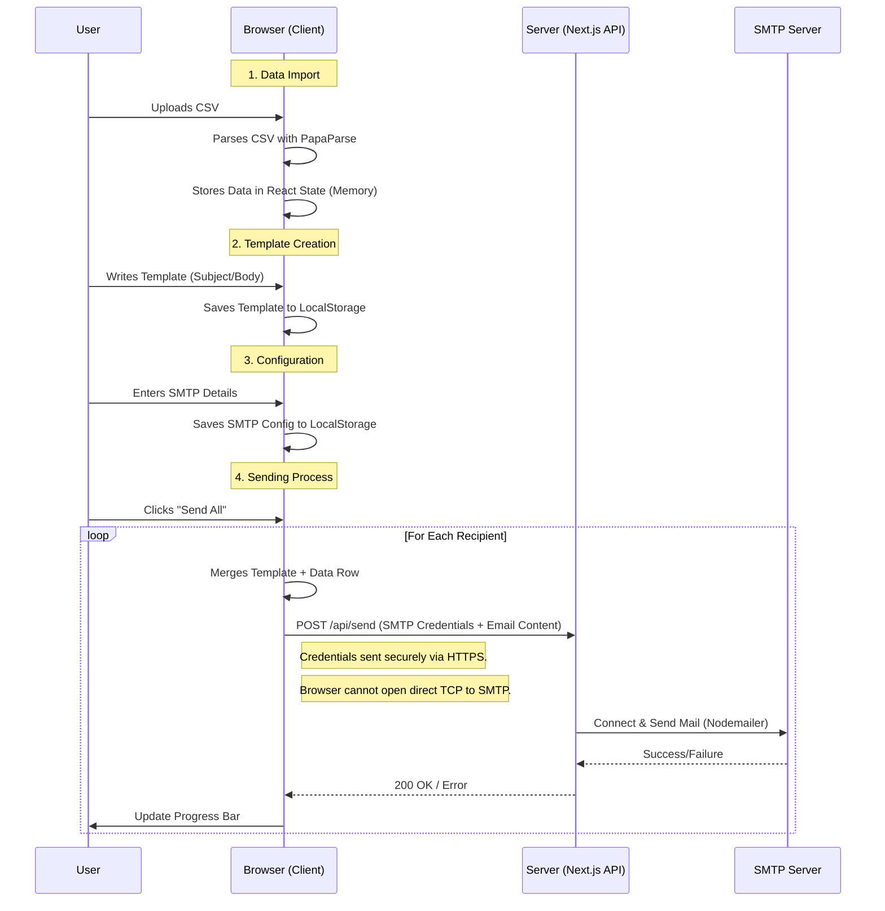

# Envía - Modern Mail Merge Tool

A modern, secure, and private mail merge application built with Next.js.

## Architecture & Data Flow

Envía is designed with a "Serverless" and "Privacy-First" architecture. Most data processing happens directly in your browser. The server is only used as a bridge to send emails via SMTP, as browsers cannot directly talk to SMTP servers.

### Data Flow Diagram



### Key Components

1.  **Client-Side (Browser)**:
    *   **Dashboard**: Main UI managing the workflow steps.
    *   **MailMergeContext**: React Context holding the "Session" state (Current Data, Template, Settings).
# Envía - Modern Mail Merge Tool

A modern, secure, and private mail merge application built with Next.js.

## Architecture & Data Flow

Envía is designed with a "Serverless" and "Privacy-First" architecture. Most data processing happens directly in your browser. The server is only used as a bridge to send emails via SMTP, as browsers cannot directly talk to SMTP servers.

### Data Flow Diagram


### Key Components

1.  **Client-Side (Browser)**:
    *   **Dashboard**: Main UI managing the workflow steps.
    *   **MailMergeContext**: React Context holding the "Session" state (Current Data, Template, Settings).
    *   **LocalStorage**: Persists your SMTP settings and Template drafts between reloads. **Your CSV data is NOT saved to LocalStorage for privacy needed for large files.**

2.  **Server-Side (Next.js API)**:
    *   `/api/send`: A stateless endpoint. It receives the SMTP credentials *per request*. It does not store them. It simply connects to the SMTP server you provided and sends the email.

### Why is a Server Required?
Browsers are sandboxed and cannot establish direct **TCP** connections (which SMTP requires). They can only communicate via **HTTP(S)** or **WebSockets**. Therefore, we need a small server-side "bridge" (the `/api/send` route) to accept the request via HTTP and then perform the TCP handshake with the SMTP provider using `nodemailer`.

## Getting Started

1.  Install dependencies:
    ```bash
    npm install
    ```
2.  Run the development server:
    ```bash
    npm run dev
    ```
3.  Open [http://localhost:3000](http://localhost:3000).

## 🚀 Deployment & Usage

### Option A: Desktop App (Electron)
The recommended way for end-users. Access local files easily and run offline.

1.  **Build**: `npm run electron:build`
2.  **Install**: Run the generated `.exe` in `dist/`.

### Option B: Web / Docker Server
Ideal for hosting on a server or for development.

**Docker:**
1.  `docker build -t envia .`
2.  `docker run -p 3000:3000 envia`

**Standard Node.js:**
1.  `npm run build`
2.  `npm start`

## Privacy Note
Your data (CSV) lives in your browser's memory. Your SMTP credentials live in your browser's LocalStorage. The server acts purely as a relay and does not persist your data or credentials.

## 📦 Application Distribution and Packaging

### Internal Distribution (Portable EXE)

1.  **Generate Build**: Run the following command in your terminal:
    ```bash
    npm run dist:win
    ```
2.  **Locate File**: The output portable `.exe` file will be generated in the `dist/` directory. It will be named something like `Envia-Portable-0.1.0.exe`.
3.  **Share**: Compress the generated file into a ZIP archive and upload it to the designated Google Drive shared folder.

### Public Distribution (MSI Installer)

1.  **Generate Build**: The same command generates the MSI installer:
    ```bash
    npm run dist:win
    ```
2.  **Locate File**: The output `.msi` file will be generated in the `dist/` directory (e.g., `Envia-0.1.0.msi`).
3.  **Sign (CRITICAL)**: **The generated MSI file MUST be signed with an Authenticode Code Signing Certificate before public release to avoid security warnings.**
4.  **Release**: Upload the signed MSI to the public download server.
